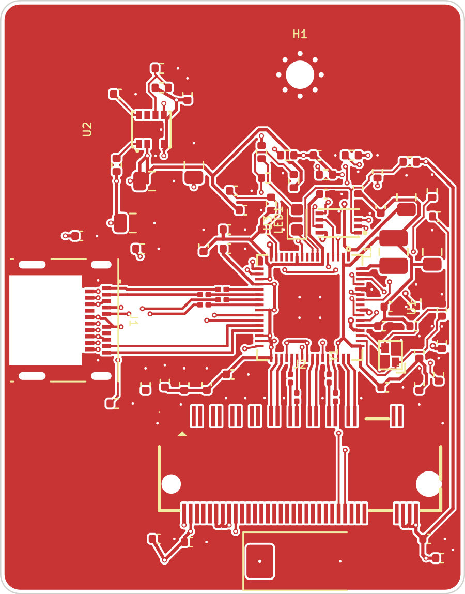
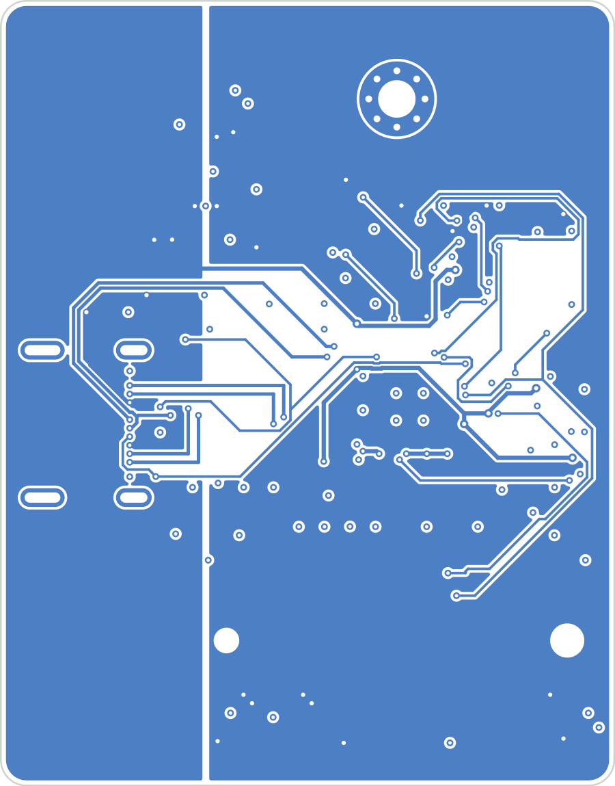

# CARTOUCHE Drive

> [!CAUTION]
> **NOT OPEN SOURCE — ALL RIGHTS RESERVED.**
> This prototype is published **for information and documentation only**, and so that the manufacturer can access the files.
> The files are public, but they are **not** licensed for reuse: you may look at them, you may **not** manufacture this board,
> have it manufactured by anyone, sell it, or distribute hardware derived from it. Any unauthorized manufacture will be
> pursued, including by filing a complaint.
>
> **CE PROJET N’EST PAS OPEN SOURCE — TOUS DROITS RÉSERVÉS.**
> Ce prototype est en ligne **uniquement à des fins d’information et de documentation**, et pour l’usine qui le fabrique.
> Il est **formellement interdit** de le fabriquer, de le faire fabriquer par qui que ce soit, de le vendre ou de diffuser
> un matériel qui en dérive. Toute fabrication non autorisée fera l’objet de poursuites, y compris d’un dépôt de plainte.

A small USB-C drive for an M.2 2230 NVMe SSD, built around the JMicron JMS583
bridge (USB 3.2 Gen 2, 10 Gb/s → PCIe Gen 3 ×2). It is the prototype drive for
[CARTOUCHE](https://cartouche.candygate.eu), a local AI that runs from a USB drive.

**Status:** schematic v0.1 (ERC 0). PCB v0.3 — 36 × 46 mm, 4 layers, all 9 high-speed pairs (5 PCIe, 4 USB 3.2) routed as straight coupled pairs; slow nets autorouted. DRC: 0 schematic mismatch, 4 unconnected and a few spacing items left. **Not ready for fabrication.**

 

## Blocks

| Block | Parts |
|---|---|
| USB-C (sink, 5 V) | Molex 105450-0101, CC pull-downs 5.1 kΩ, 100 nF on each SuperSpeed TX line |
| Bridge | JMS583 (QFN-64 8×8, 0.4 mm), 25 MHz crystal, REXT 12 kΩ 1 %, reset RC, SPI flash |
| Chip power | JMS583 internal regulators: 5 V → 1.0 V (buck, 4.7 µH) and 5 V → 3.3 V (LDO, chip only) |
| SSD power | TPS82130 3 A buck, 5 V → 3.3 V, 330 µF bulk |
| SSD | LOTES APCI0113 M.2 key M socket, 2 PCIe lanes, 220 nF on each PCIe TX line |

## Files

- `hardware/` — KiCad 9 project (`cartouche-drive.kicad_sch`), local libraries in `hardware/lib/`
- `hardware/cartouche-drive-schematic.pdf` — schematic export
- `tools/gen_schematic.py` — the connection list that generates the schematic
- `tools/build_pcb.py` — board, placement, planes and fan-out vias (KiCad Python)
- `tools/route_pcb.py` — net classes and Freerouting run

## References

- JMS583 datasheet PDS-17001 rev 1.0 (JMicron) — pin-out and required parts
- Part footprints: LCSC / EasyEDA libraries (LOTES C841669, Molex C134092, TPS82130 C473914)

## License

© 2026 CARTOUCHE. All rights reserved — see [LICENSE](LICENSE). No license is granted to manufacture, have manufactured,
sell or redistribute this design or the tools in this repository. Third-party libraries used in the KiCad project
(KiCad standard libraries, LCSC/EasyEDA footprints and 3D models) stay under their own licenses.
