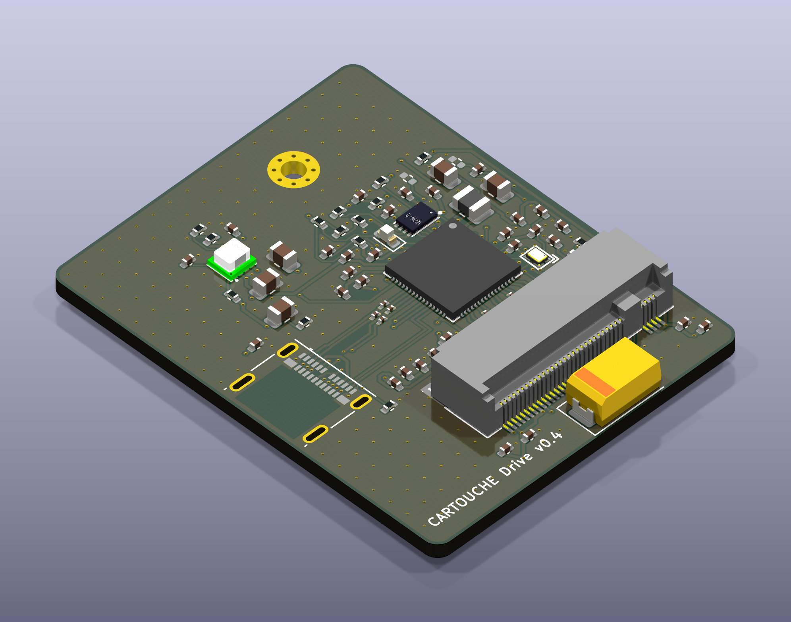
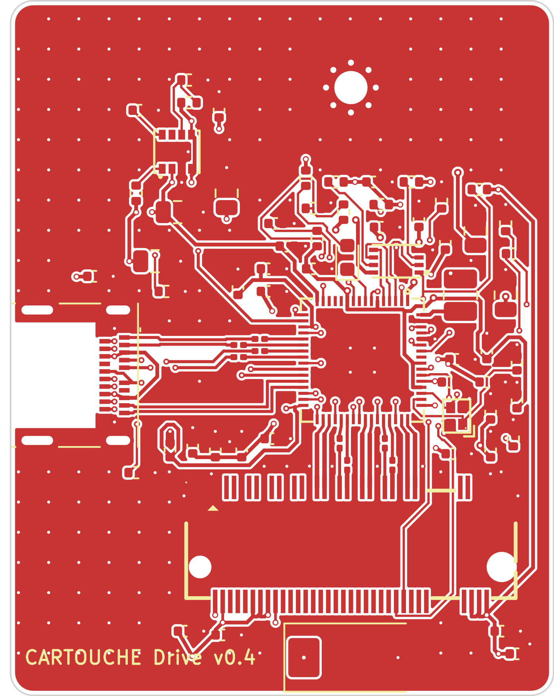
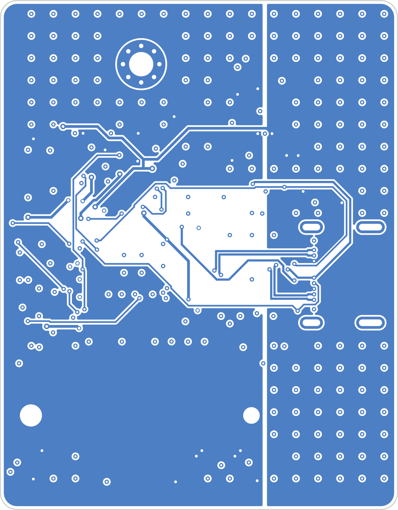

# CARTOUCHE Drive

A small USB-C drive for an M.2 2230 NVMe SSD, built around the JMicron JMS583
bridge (USB 3.2 Gen 2, 10 Gb/s → PCIe Gen 3 ×2). It is the prototype drive for
[CARTOUCHE](https://cartouche.candygate.eu), a local AI that runs from a USB drive.

**Status:** schematic v0.1 (ERC 0). PCB v0.4 — 36 × 46 mm, 4 layers (In1 GND, In2 GND + 1.0 V island), 9 high-speed pairs as straight coupled pairs (USB 0.2/0.1 mm, estimated ≈94 Ω — to be checked with JLCPCB's impedance calculator), GND stitching. DRC: 0 unconnected, 0 schematic mismatch, 2 silkscreen warnings. Fabrication files in `hardware/fab/` (Gerbers zip, JLCPCB BOM and CPL). **Prototype, not verified:** JMS583 must be consigned (0 stock at JLCPCB), CPL rotations to check in the JLCPCB viewer, LED polarity assumed active-low.

 

## Blocks

| Block | Parts |
|---|---|
| USB-C (sink, 5 V) | Molex 105450-0101, CC pull-downs 5.1 kΩ, 100 nF on each SuperSpeed TX line |
| Bridge | JMS583 (QFN-64 8×8, 0.4 mm), 25 MHz crystal, REXT 12 kΩ 1 %, reset RC, SPI flash |
| Chip power | JMS583 internal regulators: 5 V → 1.0 V (buck, 4.7 µH) and 5 V → 3.3 V (LDO, chip only) |
| SSD power | TPS82130 3 A buck, 5 V → 3.3 V, 330 µF bulk |
| SSD | LOTES APCI0113 M.2 key M socket, 2 PCIe lanes, 220 nF on each PCIe TX line |

## Files

- `hardware/` — KiCad 9 project (`cartouche-drive.kicad_sch`), local libraries in `hardware/lib/`
- `hardware/cartouche-drive-schematic.pdf` — schematic export
- `tools/gen_schematic.py` — the connection list that generates the schematic
- `tools/build_pcb.py` — board, placement, planes and fan-out vias (KiCad Python)
- `tools/route_pcb.py` — net classes and Freerouting run

## References

- JMS583 datasheet PDS-17001 rev 1.0 (JMicron) — pin-out and required parts
- Part footprints: LCSC / EasyEDA libraries (LOTES C841669, Molex C134092, TPS82130 C473914)

## License

Open source. Hardware (`hardware/`, `docs/`): [CERN-OHL-S-2.0](LICENSE-HARDWARE). Tools (`tools/`): MIT.
See [LICENSE](LICENSE). Third-party libraries used in the KiCad project (KiCad standard libraries, LCSC/EasyEDA
footprints and 3D models) stay under their own licenses.
